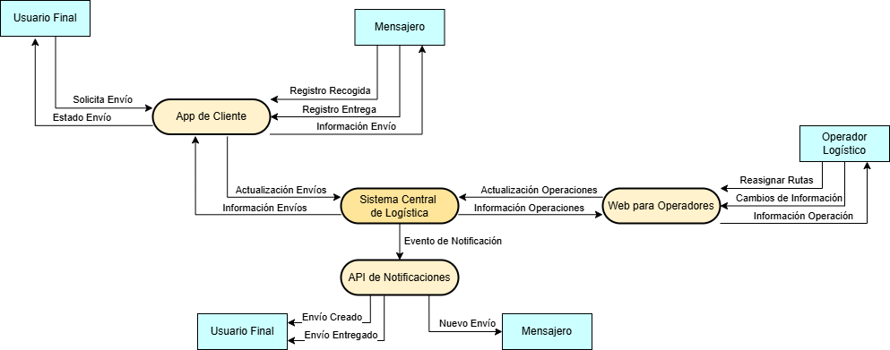
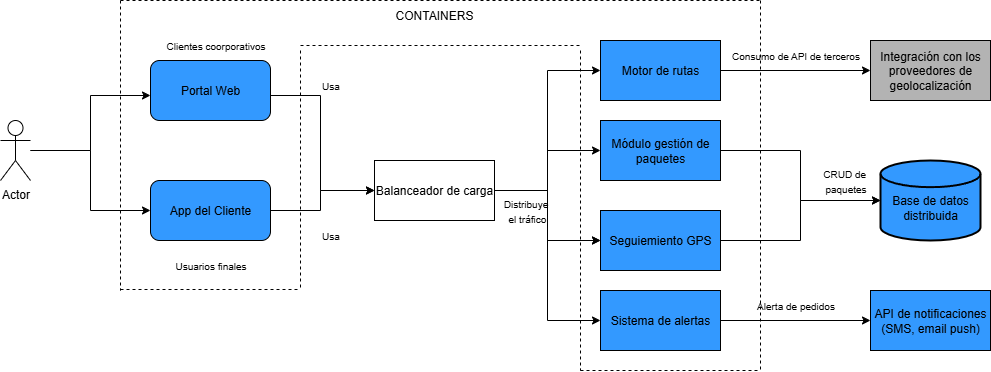

# 🗒️ Registro de Trabajo en Clase - Taller X

## 📆 Fecha de la sesión
_30 de agosto del 2025._

## 👥 Integrantes presentes
- Edwin Alejandro Gutierrez Rodriguez
- Samuel Espitia Cruz
- Nicolas Stiven Ortiz Cortes

## 🧠 Actividades realizadas en clase

A continuación, se describen los principales aspectos discutidos y las decisiones tomadas durante el desarrollo de la clase:

- **¿Qué se discutió con el equipo?** Se revisó el contexto de la empresa RedExpress, identificando los actores principales, los sistemas externos y los contenedores internos que conforman la arquitectura. Además, se discutió la forma en que los módulos se comunican y cómo integrar servicios de terceros.
- **¿Qué decisiones de modelado se tomaron?** Se acordó modelar la arquitectura usando el enfoque C4. En el C1 (Vista de Contexto) se representaron los actores externos y los sistemas principales (App de cliente, portal web corporativo, sistema central de logística y API de notificaciones). En el C2 (Vista de Contenedores) se definieron los módulos internos del sistema central (gestión de paquetes, motor de rutas, seguimiento GPS y sistema de alertas), además de los elementos de infraestructura (balanceador de carga, base de datos distribuida) y las integraciones con terceros (API de notificaciones y proveedor de geolocalización).
- **¿Qué herramientas se usaron (papel, pizarra, draw.io, Astah)?** Para la construcción de los diagramas se utilizó draw.io, lo que permitió elaborar de manera clara y colaborativa tanto la vista de contexto como la vista de contenedores.
- **¿Qué parte del trabajo se alcanzó a desarrollar?** Durante la sesión se completó la Vista de Contexto (C1), además, se comenzo a realizar la Vista de Contenedores (C2) pero no se finalizo. Dejando como tarea realizar la documentación y la finalización de C2.

## 🧩 Boceto inicial del modelo

### Vista de contexto

### Vista de contenedores

## 🔁 Tareas definidas para complementar el taller

Responsabilidades acordadas entre los miembros del equipo para completar la entrega final:

| Tarea asignada | Responsable | Fecha estimada |
|----------------|-------------|----------------|
| Modelado final en draw.io C1 | Samuel | 01/09 |
| Modelado final en draw.io C2     | Edwin y Nicolas| 02/09 |
| Redacción del informe | Nicolas | 12/08 |
| Investigación y referencias bibliográficas | Samuel | 05/09 |
| Revisión final y ajustes de formato | Edwin | 07/09 |

---

_Este documento resume el trabajo colaborativo realizado durante la sesión del taller C4 en el curso AREM - Universidad de La Sabana._
