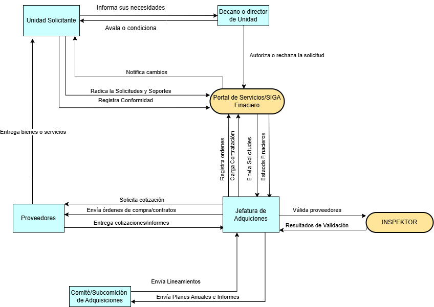
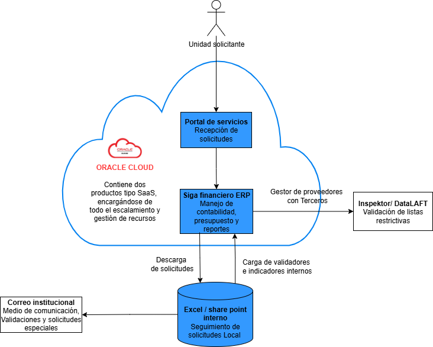

# 📄 Informe Técnico del Taller

## 🔖 Nombre del Taller
_Taller 3 - Arquitectura Actual del Sistema con el Modelo C4_

## 👥 Integrantes del equipo
- Edwin Alejandro Gutierrez Rodriguez
- Samuel Espitia Cruz
- Nicolas Stiven Ortiz Cortes

## 🧠 Descripción general del trabajo
El objetivo principal del taller fue aplicar la metodología C4 Model para representar de manera estructurada la arquitectura de sistemas en diferentes niveles de detalle. Inicialmente, se realizó un ejercicio guiado con un caso hipotético (RedExpress) para comprender cómo identificar actores, sistemas y contenedores dentro de una organización de base tecnológica.

Posteriormente, el equipo aplicó este mismo enfoque al sistema de Gestión de Adquisiciones de la Universidad de La Sabana, considerado como el cliente real en el contexto del curso.
La actividad se desarrolló de forma colaborativa, combinando sesiones de discusión en equipo con el uso de herramientas de modelado digital como draw.io.

## 🔧 Proceso de desarrollo
Para la construcción del C1 (Vista de Contexto) del sistema de adquisiciones de la Universidad de La Sabana, el equipo inició con una lectura y análisis del Manual de Adquisición de Bienes y Servicios y de la Presentación de Capacitación en Procesos de Adquisiciones. A partir de estos documentos se identificaron los actores principales, los sistemas involucrados y las relaciones entre ellos.

El modelado se realizó en draw.io, iniciando con los actores más evidentes (Unidad Solicitante, Jefatura de Adquisiciones, Proveedores) y luego se fueron incorporando instancias de validación y control (Decanos, Comité/Subcomisión, Plataforma INSPEKTOR).

## 🧩 Análisis del modelo propuesto
Incluya un análisis sobre:
- **Cómo se estructura el modelo entregado:** El modelo C1 se estructuró mostrando de manera clara los distintos actores que participan en el proceso de adquisiciones y las relaciones que mantienen entre sí. Se diferenciaron los roles que generan solicitudes, los que autorizan o validan, los que gestionan y acompañan, y aquellos que participan como proveedores externos o instancias de control. A través de las conexiones entre ellos se representa el flujo completo de la información y de las responsabilidades, resaltando la interacción continua entre áreas internas y externas que intervienen en el ciclo de adquisición.
- **Cómo representa las necesidades del cliente:** El modelo refleja de manera clara cómo las unidades solicitantes pueden iniciar y hacer seguimiento a sus solicitudes, cómo los decanos/directores aprueban presupuestos, cómo la Jefatura de Adquisiciones coordina y controla el proceso, y cómo participan actores externos como proveedores e INSPEKTOR. Con esto, se abordan las principales necesidades del cliente: trazabilidad, control financiero y cumplimiento normativo.
- **Qué supuestos se tomaron:** Se asumió que el SIGA y el Portal de Servicios se representan como un único sistema en el C1, para no sobrecargar el diagrama con detalles técnicos.
Se consideró que todos los procesos pasan de alguna forma por la Jefatura de Adquisiciones, aun cuando en la práctica puedan existir diferentes niveles de autonomía.

## 📈 Diagrama final entregado
### Vista de contexto

### Vista de contenedores

## 📋 Tabla de actores, entidades o componentes (si aplica)

| Nombre del elemento | Tipo | Descripción | Responsable |
|---------------------|------|-------------|-------------|
| Unidad solicitante  | Actor  | Dependencia académica o administrativa que identifica necesidades y registra solicitudes de adquisición. | Área solicitante |
| Decano / Director   | Actor  | Autoriza y valida presupuestalmente las solicitudes realizadas por la unidad. | Directivo de la unidad |
| Jefatura de adquisiciones | Actor | Coordina, valida y gestiona los procesos de compra o contratación. | Dirección de adquisiciones |
| Proveedores externos | Actor | Empresas o personas que ofertan bienes o servicios y cumplen las órdenes de compra. | Contratista |
| Comité / Subcomisión de adquisiciones | Actor | Instancia de control y decisión que revisa planes, indicadores y políticas del proceso. | Gobierno institucional |
| (SIGA + Portal) | Sistema | Plataforma que integra el registro, validación y trazabilidad de las solicitudes y procesos de adquisición. | Área de sistemas / financiera |
| Plataforma INSPEKTOR | Sistema externo | Herramienta de validación legal y revisión de listas restrictivas de proveedores. | Área jurídica / cumplimiento |

## 🔍 Investigación complementaria

### Uso del Modelo C4 en Casos Reales

A continuación se detalla cómo dos ejemplos distintos, Spotify y Google Maps, han aplicado o ilustrado el modelo C4 para la visualización de arquitecturas de software.

#### Caso 1: Spotify

Spotify ha adoptado la notación y las mejores prácticas del modelo C4, pero ha adaptado su capa de abstracción original al Spotify System Model". Este modelo interno utiliza niveles de diagramas que se corresponden con los del C4:

*   Diagrama de contexto del sistema (System context diagram), que es directamente el Nivel 1 (System Context) del C4.
*   Diagrama de componentes del sistema (System components diagram), equivalente al Nivel 2 (Container diagram) de C4.
*   Su concepto de "Componentes" dentro del Spotify System Model se alinea conceptualmente con el Nivel 3 (Components) de C4.
*   También utilizan un "System landscape diagram" para una vista de muy alto nivel de un conjunto de sistemas relacionados.

En términos generales, Spotify usó esta adaptación para establecer un modelo de metadatos de software estandarizado, creando un lenguaje común para visualizar su compleja red de miles de sistemas. La aplicación del modelo C4, junto con su catálogo de software en Backstage, les permitió automatizar la generación de diagramas arquitectónicos. Esta automatización asegura que los diagramas estén siempre actualizados con el diseño intencional y facilita la comprensión, comunicación y colaboración entre equipos. Además, sirve como una herramienta valiosa para el onboarding de nuevos empleados y stakeholders.

#### Caso 2: Google Maps (Ejemplo)

El sistema Google Maps fue utilizado como un ejemplo de un caso real para ilustrar la aplicación de los cuatro niveles completos del modelo C4. Este ejemplo se desglosa de la siguiente manera:

*   **Nivel 1: Diagrama de Contexto (C1)**: Describe cómo Google Maps interactúa con sus usuarios y sistemas externos, como servicios de ubicación y proveedores de datos de tráfico.
*   **Nivel 2: Diagrama de Contenedores (C2)**: Detalla las piezas principales del sistema, dividiendo Google Maps en sus contenedores principales como el *frontend*, los *servicios de backend* y las *bases de datos*.
*   **Nivel 3: Diagrama de Componentes (C3)**: Se enfoca en los internos de un contenedor específico, como el "Routing Service", mostrando módulos como el "Route Planner", "Traffic Adjuster" y "Distance Calculator".
*   **Nivel 4: Diagrama de Código (C4)**: Describe la lógica de un solo componente, como el "Distance Calculator", detallando sus métodos públicos y privados

En términos generales, este caso de Google Maps se usa para demostrar cómo los principios del C4 pueden aplicarse a cualquier aplicación y cómo la visualización jerárquica facilita la comprensión y comunicación de arquitecturas de software complejas. Los diagramas de este ejemplo fueron generados con la herramienta Mermaid Live, lo que también ilustra una forma práctica de crear estas representaciones. El uso del modelo C4, como se muestra en este ejemplo, es fundamental para tender puentes de comunicación entre equipos técnicos y no técnicos, proporcionando claridad tanto en la visión general como en los detalles.

### Resumen:
Hemos explorado dos casos del modelo C4:

*   **Spotify** adaptó las mejores prácticas del C4 a su **"Spotify System Model"** para visualizar su red de miles de sistemas. Esta adaptación permitió la automatización de diagramas arquitectónicos en Backstage, asegurando su actualización y mejorando la comunicación y colaboración entre equipos.

*   El sistema **Google Maps** se utilizó como un ejemplo práctico para ilustrar la aplicación de los cuatro niveles completos del C4. Esto demostró cómo el C4 desglosa una aplicación compleja desde el contexto hasta el código, facilitando la comprensión y comunicación de arquitecturas de software entre equipos técnicos y no técnicos.

## 📚 Referencias
- [1] https://engineering.atspotify.com/2022/07/software-visualization-challenge-accepted
- [2] https://dev.to/anwaar/c4-model-real-world-example-with-google-maps-3ano

---

_Este documento hace parte de la entrega del taller X del curso AREM (Arquitectura Empresarial) - Universidad de La Sabana._
